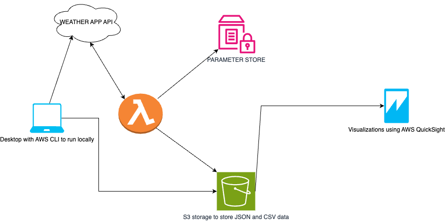
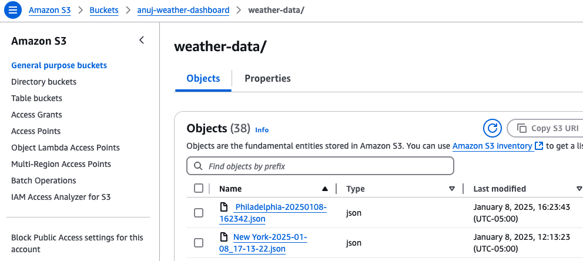

# Weather Dashboard Using Python AWS
## Day 1 
This Project is built as a part of the 30 Day DevOps challenge. 

## Overview 

The project fetches real time weather data from the openweathermap API stores it an S3 bucket, shows how to setup visualization using Amazon Sight and demonstartes the use of lambda functions  

## Key Technologies and AWS servvies used

Programming - Python 

AWS Services - S3, Lambda, Parameter Store, QuickSight

Libraries - boto3, urlib, requests, dot-env

## Architecture Diagrams



## Prerequisites
  - **AWS Account**: Sign up for an AWS account.
  - **AWS CLI**: Installed and configured to run the first half of the project locally
  - **Python 3.10 or greater**: To run the code locally.
  - **Generate your Weather API key**: https://home.openweathermap.org/api_keys

## Get Started - local setup to run the script

1. **Clone the Repository**:
   ```
   git clone https://github.com/anuj672/weather-dashboard
   ```
2. **Change Directory**:
   ``` 
   cd weather-dashboard
   ```
3. **Install requirements**:
   ``` 
   pip install -r requirements.txt
   ```
4. **create a .env file and the following contents**:   
    ```
    OPENWEATHER_API_KEY='your API key'
    AWS_BUCKET_NAME='your bucket name'
    ```
5. **Run the script**:
    ```
     python src/weather_dashboard.py
    ```
6. **Enter City names for which you want to store the weather in S3**:

    Example:
    ```
    New York, Philadelphia
    ```   

## Verify Results from AWS Console

Login to your AWS console and verify if S3 bucket files were created



## Integrating AWS lambda, Secrets Manager, Quick Sight for Visualization

For detail steps refer the following [article](https://dev.to/anuj_chetwani_96e2576b1c1/day-1-47g3)

## Overview:

1. Create an AWS lambda Function
2. Copy the code from ```src_lambda/weather_dashboard.py``` in the lambda function
3. Assign it policies to access S3 and Parameter Store
4. Set up parameter store variables
5. The script creates a new bucket with csv files - add the manifest file in the root directory of the bucket
6. Sign up/ navigate to your AWS quick Sight account and set it up to read files from your S3 bucket.
7. Perform visualization and verify results.

## Future work:

Refer open tasks for more ideas!


